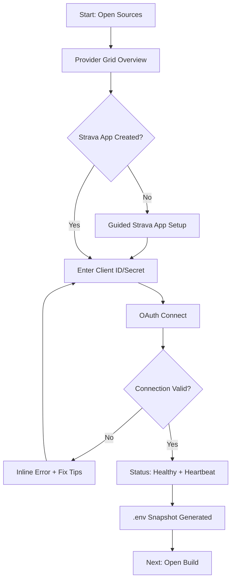
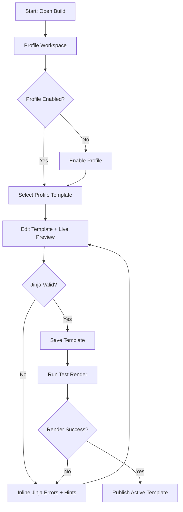
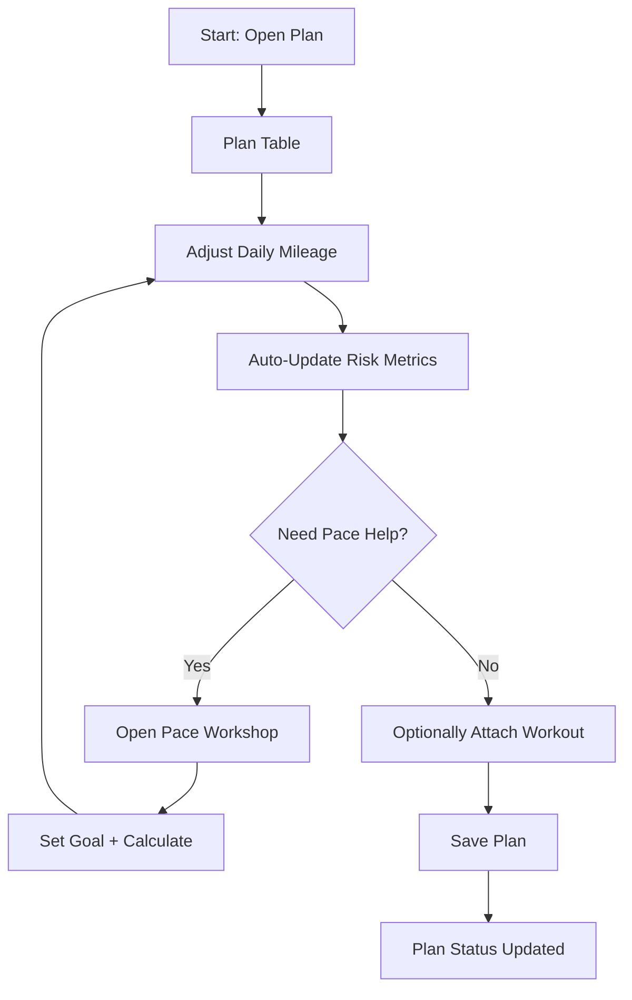
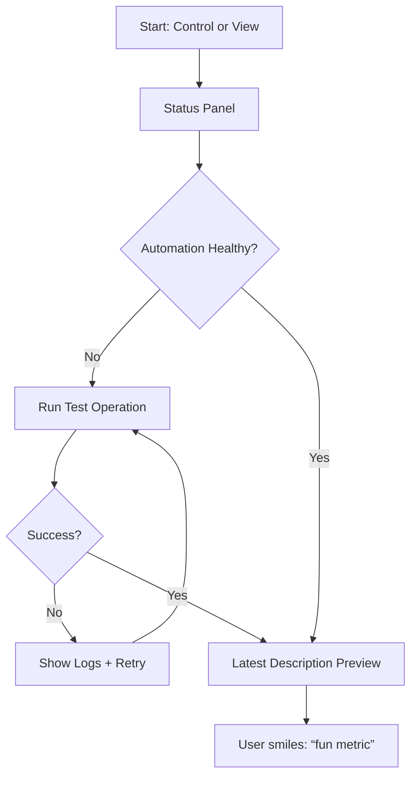

# UX Design Specification Auto-Stat-Description

**Author:** boss
**Date:** 2026-02-25

---

<!-- UX design content will be appended sequentially through collaborative workflow steps -->

## Executive Summary

### Project Vision

Chronicle is a local-first, self-hosted web app for hobby runners that consolidates planning, automated Strava descriptions, and personalized trend analytics into a single workflow. The UX should enable a small upfront burst of creativity (custom templates/profiles/workouts) followed by a “set and forget” experience with minimal ongoing touchpoints. The primary recurring moment is Sunday planning; day-to-day usage should be near-zero as automation keeps descriptions updated.

### Target Users

- **Primary:** Hobby runners comfortable with self-hosting who want automation, low-touch planning, and a single place to see the data that matters.
- **Secondary:** Users who can install Docker and run a local web app; familiar enough with Tailscale to access remotely/share.
- **Usage patterns:** Desktop/laptop for setup and template/profile/workout creation; any device for viewing and planning.

### Key Design Challenges

- Make onboarding for a self-hosted stack (Docker + local web app + Strava OAuth + optional Tailscale) feel clear and not intimidating.
- Preserve high configurability without turning the UI into a time sink.
- Design for extremely low ongoing interaction: automation must be trustworthy, and the app must be “quiet” when healthy.

### Design Opportunities

- “Set and forget” UX: clear setup checklist + strong defaults + obvious success confirmation.
- Sunday-planning emphasis: fast, focused weekly planning flow with minimal clicks and quick risk/impact feedback.
- Creative configuration surfaced early: make templates/profiles/workouts feel fun to set up, then fade into the background.

## Core User Experience

### Defining Experience

The core experience is weekly plan updates (daily mileage planning) with an intuitive flow that stitches together sources, profiles, templates, and workouts without confusion. The most critical action is moving from initial setup → enabling profiles → authoring templates with confidence.

### Platform Strategy

- **Primary platform:** Web app only.  
- **PWA:** Supported for convenience.  
- **Mobile:** Minimal Android widget (already implemented) for “today’s run distance.”  
- **Interaction modes:**  
  - Touch: Dashboard, Plan, Control  
  - Mouse/Keyboard: Build, Sources  
- **Offline:** Not required.

### Effortless Interactions

- Setup flow with zero confusion: Strava app creation → OAuth → sources connected → profiles enabled → templates configured.  
- Validation everywhere: API connections, descriptions, profiles, workouts, templates.  
- Garmin push should feel one‑click and reliable.

### Critical Success Moments

- First-time success: All sources loaded and connected.  
- “This is better” moment: Post‑run Strava description makes them laugh at a whimsical metric they configured.  
- Failure that ruins experience:  
  - Strava API app setup confusion  
  - Not understanding profiles  
  - Not understanding how to build a template from scratch

### Experience Principles

- **Clarity first:** No ambiguity in setup and configuration flows.  
- **Low‑touch by design:** Upfront effort, then hands‑off automation.  
- **Validation‑driven trust:** Users should always see if things are correct and working.  
- **Delight through whimsy:** Make the creative output rewarding and shareable.  
- **Context‑appropriate inputs:** Touch for dashboards/plan, keyboard for build/config.

## Desired Emotional Response

### Primary Emotional Goals

- **Control + mastery:** “I feel in control of everything.”  
- **Delight + pride:** “Check out this really cool automated description!”  
- **Motivation:** “Excited to go on the next run.”  
- **Premium confidence:** “Wow, this looks modern and premium.”

### Emotional Journey Mapping

- **Discovery:** Fun, creative, motivating.  
- **Setup:** Guided and supported; “this isn’t hard.”  
- **Sunday planning:** Experimental and playful, with visual confidence (risk factors visible).  
- **Post‑run / Strava check:** Big grin, absorbed in the story, noticing hidden signals and trends.  
- **When something breaks:** Calm and in control; “restart Docker and I’m good.”

### Micro‑Emotions

- Confidence, trust, delight, playfulness, control, motivation, pride.

### Design Implications

- **Premium visual polish** → reinforces modern, high‑control feeling.  
- **Guided setup + validation** → reduces anxiety and builds trust.  
- **Explorable planning UI** → supports experimentation without risk.  
- **Story‑first output** → creates delight and shareable moments.  
- **Simple recovery messaging** → keeps calm when errors occur.

### Emotional Design Principles

- **Make control visible:** status, validation, and clear next steps.  
- **Make success feel fun:** whimsical metrics + story framing.  
- **Make effort feel small:** guided flows, minimal clicks, automation.  
- **Make reliability feel obvious:** health checks and simple recovery actions.

## UX Pattern Analysis & Inspiration

### Inspiring Products Analysis

- **Strava**: Strong social storytelling and post‑activity framing; good at turning data into shareable narratives.  
- **Garmin**: Direct, utilitarian “here’s your data” presentation; efficient for quick reference.  
- **SmashRun / Intervals.icu**: Data‑dense, analytical depth; powerful for serious review.  
- **Community tools (Statistics‑for‑Strava, garmin_planner, git‑sweaty, Strautomator, activity‑craft)**: Utility‑first experiences that solve specific pain points with minimal friction.

### Transferable UX Patterns

- **Story‑first summaries** (Strava): turn raw data into a coherent narrative.  
- **Single‑purpose flows** (community tools): keep task flows focused and lightweight.  
- **Data‑dense dashboards** (SmashRun/Intervals): rich insights without burying key takeaways.  
- **Quick‑reference panels** (Garmin): fast access to today’s essentials.

### Anti‑Patterns to Avoid

- **Frankenstein UX**: disjointed components that feel stitched together.  
- **Over‑socialization**: unnecessary feeds, influencers, or club clutter.  
- **Over‑complex setup**: technical friction without guided support.

### Design Inspiration Strategy

**Adopt:**  
- Story‑first post‑run summaries (Strava)  
- Task‑focused planning flows (community tools)  

**Adapt:**  
- Data‑dense analytics (SmashRun/Intervals) → present in a calmer, more minimal layout  
- Quick‑reference Garmin‑style panels → blend into a cohesive Chronicle visual system  

**Avoid:**  
- Mixed visual languages or mismatched UI styles  
- Excessive social features that distract from planning/automation

## Design System Foundation

### 1.1 Design System Choice

**Established system** (Material Design‑based component library).

### Rationale for Selection

- **Speed and maintainability** matter most for this project.  
- Established systems provide **proven accessibility and interaction patterns**.  
- The UI should be easy for an AI agent to build consistently without custom design overhead.  
- Existing brand assets (logo icon + banner) can be layered on top through theming.

### Implementation Approach

- Use a Material‑based system as the UI foundation.  
- Keep layouts clean and modern; rely on system defaults where possible.  
- Apply brand assets via header, iconography, and color accents.

### Customization Strategy

- Light theming only: primary/secondary colors, typography, spacing scale.  
- Avoid heavy bespoke components unless essential to a unique flow.  
- Prioritize consistency and clarity over visual novelty.

## 2. Core User Experience

### 2.1 Defining Experience

The defining experience is the **custom automated description**: “Check out my custom description!” The product wins if users can reach a working, personalized output quickly and then forget about it.

### 2.2 User Mental Model

Users view Chronicle as a **local data hub**: “bring my data locally and do what I want with it.” Today, they cobble together scripts or pay for scattered services; Chronicle replaces that with a single, streamlined flow.

### 2.3 Success Criteria

- **Low‑touch operation:** once configured, it keeps working without frequent visits.  
- **Reliably updated descriptions:** output is set automatically and consistently.  
- **Fast, snappy UI:** no bloat—feels lighter than Strava/Garmin.

### 2.4 Novel UX Patterns

This is a **novel interaction model** (a local‑first automation + storytelling system). It will require **guided education** and clear onboarding to help users understand how data → profiles → templates → automated descriptions connect.

### 2.5 Experience Mechanics

**Initiation:**  
- User starts with a guided setup checklist (sources → OAuth → validation).

**Interaction:**  
- Enable profiles → customize templates → preview against real data → enable automation.

**Feedback:**  
- Clear validation states for each step (connections, templates, profiles).  
- “Last generated description” preview + success confirmations.

**Completion:**  
- User sees their next activity auto‑updated with the custom description.  
- System shows “healthy” status and fades into background.

## Visual Design Foundation

### Color System

- **Core palette:** dark‑mode base (near‑black) with dark‑gray ghosting layers.  
- **Primary accent:** neon orange (Strava‑inspired) used for key actions, highlights, and status.  
- **Secondary accents:** allowed at designer discretion to add premium “pops” while preserving cohesion.  
- **Semantic mapping:** primary (orange), secondary (designer‑chosen), success/warn/error (standard AA‑compliant palette).  
- **Aesthetic goal:** premium, luxury, Porsche‑like — minimal but sharp contrast.

### Typography System

- **Tone:** sleek modern.  
- **Hierarchy:** strong H1/H2 for sectioning; clear body text for long‑form templates.  
- **Legibility:** prioritize clarity on dark backgrounds and maintain AA contrast.

### Spacing & Layout Foundation

- **Density:** balanced — no clutter, but not overly airy.  
- **Grid:** consistent modular grid to avoid “frankenstein” layout.  
- **Layout rhythm:** clear separation between sections; cards/panels used to group functional areas.

### Accessibility Considerations

- **Contrast:** WCAG AA for text and interactive elements.  
- **States:** focus, hover, and error states clearly visible on dark UI.  
- **Readability:** body text sizes and line heights optimized for dark mode reading.

## Design Direction Decision

### Design Directions Explored

- Chronicle Blackbox: balanced MPA layout with shared nav and card system.
- Porsche Cockpit: bold, fast status/ops view with hero actions.
- Workshop Focus: Build page as a creative studio (drawer + live preview).
- Plan Ledger: dense plan table with pace drawer support.
- Sources Atelier: premium onboarding and provider management.
- Heatmap Gallery: View page as story + trends showcase.

### Chosen Direction

**Chronicle Blackbox + Heatmap Gallery with Porsche accents.**  
A premium, low-touch dashboard-led experience that keeps a consistent MPA shell while giving each page a signature gesture.

### Design Rationale

- **Low-touch promise:** View page answers “Is it working?” + “What’s next?” in one glance.
- **Consistency:** MPA nav and card language remain stable; reduces cognitive load.
- **Distinct page identities:** Each page gets a signature focus without fracturing the system.
- **Luxury contrast:** Neon orange stays rare and intentional, amplifying premium feel.

### Implementation Approach

- **View:** Heatmap + story card + status + today’s plan in a calm dashboard layout.
- **Plan:** Dense ledger table as hero; pace drawer as secondary ritual tool.
- **Build:** Workshop drawer + editor + live preview (“studio” feel).
- **Control:** Porsche cockpit energy (hero actions + status panel).
- **Sources:** Atelier onboarding (provider grid + `.env` snapshot).
- **Color usage:** Neon orange only for primary CTAs and active nav state; graphite/steel for everything else.

## User Journey Flows

### 1) First-Time Setup + Sources Validation

**Goal:** Connect all providers and validate readiness with minimal confusion.

### 2) Build Profile + Template + Validation

**Goal:** Enable profiles and create a working template with confidence.

### 3) Weekly Planning + Pace Workshop

**Goal:** Adjust mileage quickly, verify risk, optionally attach workout.

### 4) Automation + Description Verification

**Goal:** Confirm automation is working with minimal touch.

### Journey Patterns

- **Navigation:** consistent top-nav + page “signature gesture.”
- **Decision:** inline validation loops, not modal blocking.
- **Feedback:** always show health/last run/last render.

### Flow Optimization Principles

- Minimize steps to first success (connect → validate → render).
- Keep error handling inline with clear fixes.
- Highlight “healthy” state to reinforce low-touch promise.

## Component Strategy

### Design System Components

Using a Material-based system with light theming:

- Buttons, inputs, toggles, chips, badges
- Cards, drawers, tabs
- Tables, tooltips, dialogs, banners
- Icons, progress indicators, snackbars

### Custom Components

### Provider Connection Card

**Purpose:** Show each source’s status, auth actions, and guidance.  
**Usage:** Sources page grid.  
**Anatomy:** Provider logo, name, status badge, primary action, help text.  
**States:** default, connected, warning, error, disabled.  
**Variants:** compact (grid), expanded (details).  
**Accessibility:** ARIA status + button labels, focus order.  
**Content Guidelines:** short, actionable instructions only.  
**Interaction Behavior:** inline actions, inline error tips.  

### Health / Heartbeat Status Badge

**Purpose:** Communicate system health at a glance.  
**Usage:** View + Control.  
**States:** healthy, warning, error, stale.  
**Accessibility:** aria-live for status changes.  

### Template Workshop Drawer

**Purpose:** Enable profiles + manage templates without leaving Build.  
**Usage:** Build page.  
**States:** collapsed, expanded, validation error, loading.  
**Accessibility:** keyboard focus trap, aria-expanded.  

### Live Preview Panel

**Purpose:** Show rendered description with errors in context.  
**Usage:** Build page.  
**States:** preview ok, render error, loading.  
**Interaction Behavior:** highlight failing Jinja lines.  

### Plan Ledger Table

**Purpose:** Dense plan editor with risk visualization.  
**Usage:** Plan page.  
**States:** normal, warning, risk highlight.  
**Variants:** compact (mobile), full (desktop).  
**Accessibility:** table semantics + row focus.  

### Pace Workshop Drawer

**Purpose:** Goal → pace calculations.  
**Usage:** Plan page.  
**States:** collapsed/expanded, validation error.  
**Accessibility:** form labels + keyboard.  

### Operations Runner Table

**Purpose:** Run API operations + show status.  
**Usage:** Control page.  
**States:** idle, running, success, error.  
**Interaction Behavior:** inline run buttons + status chips.  

### Story Card

**Purpose:** Latest description + whimsical metric.  
**Usage:** View.  
**States:** loading, ready, error.  

### Plan “Today” CTA

**Purpose:** Highlight today’s workout + Garmin send.  
**Usage:** View + Control.  
**States:** ready, queued, sent, error.  

### Component Implementation Strategy

- Use Material components as the base and theme them with Chronicle tokens.
- Custom components built as composed patterns (cards + chips + badges).
- Keep nav + card language consistent across pages.
- Apply AA contrast + focus visibility for all states.

### Implementation Roadmap

**Phase 1 - Core:** Provider Connection Card, Plan Ledger Table, Template Workshop Drawer, Live Preview Panel  
**Phase 2 - Supporting:** Operations Runner Table, Pace Workshop Drawer, Story Card  
**Phase 3 - Enhancements:** Health Badge variants, Today CTA refinements

## UX Consistency Patterns

### Button Hierarchy

**When to Use:** Actions that progress a flow vs. optional or destructive actions.  
**Visual Design:** Primary = neon orange, Secondary = ghost/outline, Tertiary = text/quiet.  
**Behavior:** One primary action per section; destructive actions require confirmation.  
**Accessibility:** Clear focus ring, AA contrast, aria-labels for icon buttons.  
**Mobile Considerations:** Primary CTA always visible; avoid stacked destructive actions.  

### Feedback Patterns

**When to Use:** Status changes, validation, automation health, operations outcomes.  
**Visual Design:** Status chips with color + icon; inline banners for errors.  
**Behavior:** Inline success confirmation; errors always actionable with fixes.  
**Accessibility:** `aria-live` for async updates; text + color for meaning.  

### Form Patterns

**When to Use:** Setup inputs, template fields, pace inputs.  
**Visual Design:** Labels above inputs; helper text below; error text inline.  
**Behavior:** Validate on blur + on submit; never block without showing fix.  
**Accessibility:** Proper labels, `aria-describedby` for hints/errors.  
**Mobile Considerations:** Use numeric input modes for time/distance.  

### Navigation Patterns

**When to Use:** All pages within MPA shell.  
**Visual Design:** Persistent top nav; active tab highlighted with orange.  
**Behavior:** Keep page identity with hero title + signature gesture.  
**Accessibility:** `aria-current="page"` in nav.  

### Additional Patterns

**Loading/Empty States**  
- Loading: skeletons for tables and cards.  
- Empty: show “what to do next” (connect sources, create template, add plan).  

**Drawer/Workshop Patterns**  
- Drawers used for “ritual tools” (pace workshop, template workshop).  
- Always show close action and retain state between sessions.  

**Status/Health Patterns**  
- “Healthy” state always visible on View/Control.  
- Stale tokens show warning with retry button.  

### Design System Integration

- Use Material base components; apply Chronicle tokens for accent and radii.  
- Keep orange minimal; use graphite/steel for surfaces.  

### Mobile Considerations

- Dense tables collapse to summary cards + expandable rows.  
- Drawers become full-width sheets with sticky close action.

## Responsive Design & Accessibility

### Responsive Strategy

- **Desktop-first:** Primary surface for Build/Sources with dense layouts and multi-column views.
- **Mobile focus:** View/Plan are primary; Build/Sources remain accessible but simplified into guided steps.
- **Drawers → full-screen sheets** on mobile with sticky headers and clear close actions.
- **Tables → row cards** on mobile; retain semantic tables on desktop.

### Breakpoint Strategy

- Mobile: 320–767px  
- Tablet: 768–1023px  
- Desktop: 1024px+  
- Standard breakpoints for simplicity and maintainability.

### Accessibility Strategy

- **Target:** WCAG AA.
- Contrast minimum 4.5:1 for text and interactive elements.
- Keyboard navigation across nav, drawers, tables, and controls.
- Visible focus indicators for all interactive elements.
- Touch targets ≥ 44x44px.
- `aria-live` for async status changes (health, ops, renders).
- Avoid hover-only interactions; always provide focus states.

### Testing Strategy

- Responsive: test small phone, large phone, and tablet sizes.
- Browser coverage: Chrome, Firefox, Opera.
- Accessibility: keyboard-only traversal, contrast checks on dark surfaces, drawer focus-trap verification.

### Implementation Guidelines

- Layout changes done in CSS (avoid JS layout logic).
- Use semantic HTML for tables and forms.
- Mobile-first overrides for critical flows; desktop enhancements layered on top.
- Ensure error messages convey meaning with text + color.
